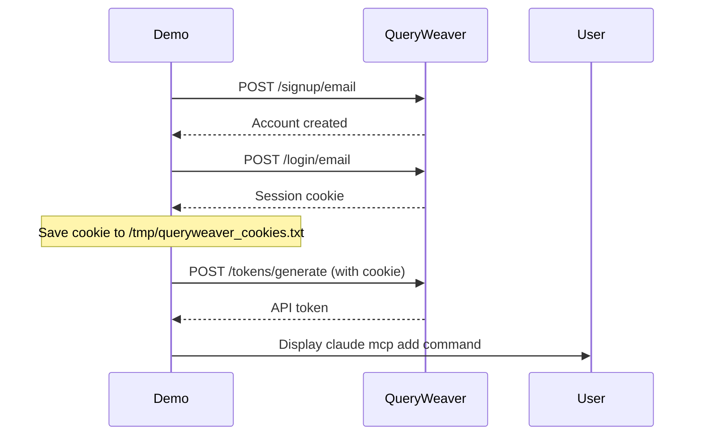

# Integration Demo - nomad-mcp-pack

This demo showcases the complete end-to-end workflow of generating a Nomad Pack from an MCP server in the official registry and deploying it to a live Nomad cluster.

## Overview

The integration demo demonstrates:

1. **Prerequisites Check**: Validating environment and connectivity
2. **Pack Generation**: Creating Nomad Pack from MCP Registry server definitions
3. **Pack Inspection**: Examining generated templates and configuration
4. **Deployment Planning**: Using nomad-pack to preview deployment with static ports
5. **Live Deployment**: Deploying the MCP server to Nomad cluster with Traefik routing
6. **Job Verification**: Checking job status and health
7. **Allocation Inspection**: Examining allocation details and port configuration
8. **Log Analysis**: Inspecting server logs for troubleshooting
9. **Claude Code Integration**: Automated token generation and MCP server configuration
10. **Cleanup**: Gracefully stopping jobs and removing pack artifacts and authentication files

## Demo Server

The demo uses **com.falkordb/QueryWeaver** as the example MCP server:

- **Package Type**: OCI (Docker container)
- **Transport Type**: streamable-http (HTTP-based communication)
- **Image**: `docker.io/falkordb/queryweaver:0.0.11`
- **Description**: FalkorDB-based MCP server providing graph database capabilities
- **Port Configuration**: Static host port 8091 (for reliable Traefik routing)

This server was chosen because it:
- Demonstrates Docker-based deployment with OCI images
- Showcases HTTP transport with external load balancer integration
- Is actively maintained and reliable
- Provides a realistic use case (graph database querying)
- Requires authentication (demonstrates token generation workflow)

### Port Allocation Strategy

The demo uses **static port allocation** (`host_port=8091`) instead of dynamic ports for these reasons:

- **Simplified Load Balancer Integration**: Traefik can connect directly to port 8091 without requiring Consul service discovery
- **Predictable Access**: The MCP server is always accessible at the same port across deployments
- **Reliable Routing**: Eliminates timeout issues that can occur with dynamic port resolution

While Nomad's dynamic port allocation is ideal for most workloads, static ports are simpler for external access scenarios where the load balancer doesn't have Consul integration configured.

## Prerequisites

### Required Environment Variables

```bash
export NOMAD_ADDR="http://your-nomad-cluster:4646"
export NOMAD_TOKEN="your-nomad-acl-token"
```

### Required Executables

1. **nomad-mcp-pack** - Build from this repository:
   ```bash
   make build
   ```

2. **nomad-pack** - Install from HashiCorp:
   ```bash
   # macOS
   brew install hashicorp/tap/nomad-pack

   # Linux/Other
   # See: https://github.com/hashicorp/nomad-pack#installation
   ```

3. **nomad** - Install Nomad CLI:
   ```bash
   # macOS
   brew install nomad

   # Linux/Other
   # See: https://www.nomadproject.io/downloads
   ```

4. **jq** - JSON processor for automated token generation:
   ```bash
   # macOS
   brew install jq

   # Linux (Debian/Ubuntu)
   apt-get install jq

   # Linux (RHEL/CentOS)
   yum install jq
   ```

### Nomad Cluster Requirements

- Nomad cluster must be accessible via NOMAD_ADDR
- Your NOMAD_TOKEN must have permissions to:
  - Submit jobs
  - Read job status
  - Read allocation information
  - Stop jobs
- At least one Nomad client node with:
  - Docker driver enabled
  - Sufficient resources (500 MHz CPU, 512 MiB memory)
  - Internet access to pull Docker images

### Network Requirements

- Internet connectivity to:
  - MCP Registry API (`registry.modelcontextprotocol.io`)
  - Docker Hub (`docker.io`) for image pulls

## Usage

### Interactive Mode (Default)

Run the demo with pauses between sections for presentation or learning:

```bash
cd demo/integration
./demo.sh
```

Press Enter at each pause to continue to the next section.

### Automatic Mode

Run the demo without pauses for CI/CD or testing:

```bash
cd demo/integration
./demo.sh auto
```

## What to Expect

### Timing

- **Interactive Mode**: ~5-10 minutes (depending on pause lengths)
- **Automatic Mode**: ~2-3 minutes

### Output

The demo provides color-coded output:

- 🔵 **Blue**: Section headers and important information
- 🟢 **Green**: Success messages and step descriptions
- 🟡 **Yellow**: Warnings and pause prompts
- 🔴 **Red**: Errors (if any)
- 🟣 **Purple**: Commands being executed
- 🔷 **Cyan**: Informational messages

### Demo Sections

1. **Prerequisites Check**: Validates environment and connectivity
2. **Pack Generation**: Creates Nomad Pack from MCP Registry
3. **Pack Inspection**: Shows generated files and configuration
4. **Deployment Planning**: Runs nomad-pack plan (dry-run) with static port configuration
5. **Deployment Execution**: Deploys to Nomad cluster with static port 8091
6. **Job Verification**: Checks job status
7. **Allocation Inspection**: Examines allocation details and ports
8. **Log Inspection**: Views MCP server startup logs
9. **Connecting to Claude Code**: Automated token generation and MCP server configuration
10. **Cleanup**: Stops job, removes pack artifacts and authentication files
11. **Summary**: Recaps what was demonstrated

### Expected Outputs

**Job Status Example:**
```
ID            = com-falkordb-QueryWeaver-0-0-11-oci-streamable-http
Status        = running
Type          = service
Datacenters   = dc1
```

**Allocation Addresses Example:**
```
Allocation Addresses:
Label  Dynamic  Address
*http  yes      10.0.2.199:25102
```

**Log Example:**
```
INFO:     Uvicorn running on http://0.0.0.0:5000 (Press CTRL+C to quit)
INFO:     Application startup complete.
```

**Section 8 - Token Generation Example:**
```
✓ QueryWeaver backend is ready!
ℹ Creating QueryWeaver account...
ℹ Logging in...
ℹ Generating API token...
✓ Token generated successfully!

ℹ QUERYWEAVER_TOKEN=a1b2c3d4e5f6...

Run this command to add QueryWeaver to Claude Code:

$ claude mcp add --scope=user --transport=http \
    --header="Authorization: Bearer a1b2c3d4e5f6..." \
    queryweaver \
    'http://hashistack-demo-dc1-7329a99ab7f6a3ba.elb.us-east-1.amazonaws.com/queryweaver/mcp'
```

**Port Allocation with Static Port:**
```
Allocation Addresses:
Label  Dynamic  Address
*http  no       10.0.2.199:8091
```

Note: With static port allocation (`host_port=8091`), the Dynamic column shows "no" and the port is always 8091.

## Troubleshooting

### Common Issues

#### 1. "No path to region" Error

**Symptom**: nomad-pack plan fails with "No path to region"

**Cause**: The region specified doesn't match your Nomad cluster configuration

**Solution**:
```bash
# Check your cluster's region
nomad server members

# The demo auto-detects region, but you can override:
# Edit the NOMAD_REGION variable in demo.sh
```

#### 2. Missing Environment Variables

**Symptom**: "NOMAD_ADDR environment variable is not set"

**Solution**:
```bash
export NOMAD_ADDR="http://your-nomad-cluster:4646"
export NOMAD_TOKEN="your-token"
```

#### 3. Image Pull Failures

**Symptom**: Allocation fails with "Failed to pull image"

**Possible Causes**:
- Nomad client nodes can't reach Docker Hub
- Rate limiting from Docker Hub
- Network connectivity issues

**Solution**:
- Check Docker daemon is running on Nomad clients
- Verify internet connectivity from clients
- Consider using Docker Hub authentication for rate limits

#### 4. Port Allocation Issues

**Symptom**: No port allocated or port conflicts

**Cause**: Network block not generated or ports exhausted

**Solution**:
- Verify pack template has network block for HTTP transport
- Check available ports on Nomad clients
- Review client configuration for port ranges

#### 5. Pack Already Exists

**Symptom**: Generation fails because pack directory exists

**Solution**:
The demo cleans up automatically, but if needed:
```bash
rm -rf packs/com-falkordb-QueryWeaver-*
```

## Advanced Usage

### Customizing Pack Variables

You can modify the demo to pass custom variables:

```bash
# In demo.sh, change the nomad-pack run command:
nomad-pack run \
  --var="region=$NOMAD_REGION" \
  --var="cpu=1000" \
  --var="memory=1024" \
  --var="count=2" \
  .
```

### Controlling Demo Log Output

The demo sets `NOMAD_MCP_PACK_LOG_LEVEL=error` for cleaner demonstration output. You can adjust this for debugging:

```bash
# More verbose output (shows info messages)
export NOMAD_MCP_PACK_LOG_LEVEL=info
./demo.sh

# Debug mode (shows all details including pack generation internals)
export NOMAD_MCP_PACK_LOG_LEVEL=debug
./demo.sh

# Warning level (only warnings and errors)
export NOMAD_MCP_PACK_LOG_LEVEL=warn
./demo.sh
```

**Available log levels**: `debug`, `info`, `warn`, `error`

**Default in demo**: `error` (cleanest output for presentations)
**Default in nomad-mcp-pack**: `info` (when not set)

### Customizing Service Registration

Generated packs for HTTP-based MCP servers automatically include service registration with Consul. You can customize the service configuration:

```bash
# Custom service name
nomad-pack run --var="service_name=my-mcp-server" .

# Custom container port
nomad-pack run --var="container_port=5000" .

# Static host port (recommended for load balancer integration)
# Use host_port for static port allocation, or 0 for dynamic (default)
nomad-pack run \
  --var="container_port=5000" \
  --var="host_port=8091" \
  .

# Add Traefik routing tags for external access
nomad-pack run \
  --var='service_tags=["traefik.enable=true","traefik.http.middlewares.myserver-strip.stripprefix.prefixes=/myserver","traefik.http.routers.myserver.entrypoints=http","traefik.http.routers.myserver.rule=Host(`example.com`) && PathPrefix(`/myserver`)","traefik.http.routers.myserver.middlewares=myserver-strip"]' \
  .
```

**Understanding Traefik Service Tags:**

The demo configures Traefik for external access with these specific tags:

- `traefik.enable=true` - Enables Traefik routing for this Consul service
- `traefik.http.middlewares.queryweaver-strip.stripprefix.prefixes=/queryweaver` - Creates a middleware that removes the `/queryweaver` prefix before forwarding requests to the backend
- `traefik.http.routers.queryweaver-mcp.entrypoints=http` - Routes traffic through HTTP entrypoint (port 80)
- `traefik.http.routers.queryweaver-mcp.rule=Host(...) && PathPrefix(...)` - Matches requests for specific host and path prefix
- `traefik.http.routers.queryweaver-mcp.middlewares=queryweaver-strip` - Applies the strip prefix middleware to this router
- `traefik.http.routers.queryweaver-mcp-secure.tls.certresolver=letsencrypt` - Enables automatic HTTPS with Let's Encrypt

This configuration allows:
- **External access**: `http://your-load-balancer/queryweaver/mcp`
- **Container sees**: `/mcp` (prefix `/queryweaver` is stripped by middleware)
- **Automatic HTTPS**: Let's Encrypt handles TLS certificates

```bash
# Custom health check intervals
nomad-pack run \
  --var="health_check_interval=60s" \
  --var="health_check_timeout=10s" \
  .
```

**Port Allocation Modes:**

- **Dynamic ports (default)**: Set `host_port=0` or omit the variable. Nomad allocates a random available port. Requires load balancers to use Consul service discovery for port resolution.
- **Static ports**: Set `host_port` to a specific port number (e.g., `8091`). The MCP server will always bind to that host port. Simpler for load balancer integration when service discovery is not configured.

See the generated pack's README for more details on service registration options.

### Testing Different MCP Servers

To try different servers, modify `DEMO_SERVER` in demo.sh:

```bash
# Other OCI + HTTP servers found in the registry:
DEMO_SERVER="io.github.eat-pray-ai/yutu"          # Transport: streamable-http
DEMO_SERVER="io.github.andrasfe/vulnicheck"       # Transport: streamable-http
DEMO_SERVER="io.github.jgador/websharp"           # Transport: streamable-http
```

### Deploying to Different Datacenters

```bash
# Modify the nomad-pack commands:
nomad-pack plan --var="region=us-west" --var="datacenters=[\"dc2\",\"dc3\"]" .
```

## Integration Points Demonstrated

### 1. MCP Registry → nomad-mcp-pack

- Queries MCP Registry API for server metadata
- Resolves `@latest` versions automatically
- Validates server status (active vs deprecated)
- Extracts package and transport configuration

### 2. nomad-mcp-pack → Nomad Pack Format

- Generates HCL templates compatible with nomad-pack
- Creates variables.hcl with configurable parameters
- Produces metadata.hcl with pack information
- Includes helper templates for reusable logic
- Automatically includes service registration for HTTP/SSE transport
- Infers sensible defaults for service names and container ports

### 3. Nomad Pack → Nomad Job

- nomad-pack renders templates with variable substitution
- Validates job specification before submission
- Submits job to Nomad API with proper authentication

### 4. Docker Driver Integration

- Nomad pulls Docker images from registry
- Configures container with environment variables
- Maps dynamic ports for HTTP transport
- Monitors container health and logs

### 5. Network Configuration & Service Registration

- Dynamic port allocation for HTTP-based servers
- Automatic container port mapping (configurable via variables)
- Port mapping visible in allocation addresses
- Automatic Consul service registration with TCP health checks
- Customizable service tags for load balancer integration (Traefik, Fabio, etc.)
- Configurable health check intervals and timeouts

## Key Differences: HTTP vs stdio Transport

### stdio Transport
- No network port required
- Process communication via stdin/stdout
- Simpler for local/embedded use cases
- Example: Most NPM-based MCP servers

### HTTP Transport (streamable-http)
- Requires network port allocation
- Client-server communication over HTTP
- Better for distributed deployments
- Example: This demo (QueryWeaver)
- Nomad allocates dynamic port automatically
- Port visible in allocation addresses

## Connecting to the Deployed MCP Server

After successfully deploying QueryWeaver to your Nomad cluster, you can connect Claude Code (or other MCP clients) to use the server.

### Automated Token Generation (Demo Default)

**Section 9 of the demo automates the entire authentication workflow**. The script:

1. Waits for QueryWeaver backend (FalkorDB) to be fully ready (up to 90 seconds)
2. Creates a QueryWeaver account via `/signup/email` API
3. Logs in and saves session cookie to `/tmp/queryweaver_cookies.txt`
4. Generates an API token using the authenticated session
5. Provides the complete `claude mcp add` command with your token

**Example Output from Demo:**

```bash
✓ QueryWeaver backend is ready!
ℹ Creating QueryWeaver account...
ℹ Logging in...
ℹ Generating API token...
✓ Token generated successfully!

ℹ QUERYWEAVER_TOKEN=abc123xyz456...

Run this command to add QueryWeaver to Claude Code:

$ claude mcp add --scope=user --transport=http \
    --header="Authorization: Bearer abc123xyz456..." \
    queryweaver \
    'http://your-load-balancer/queryweaver/mcp'
```

Simply copy and run the `claude mcp add` command shown in the demo output.

### Authentication Flow Details

The automated authentication uses **cookie-based sessions** to mirror browser-based authentication:



### Manual Token Generation (Fallback)

If the automated flow fails or you need to generate a token manually:

**Step 1: Create Account**

```bash
# Replace with your Traefik/load balancer URL
QUERYWEAVER_URL="http://your-nomad-cluster/queryweaver"

curl -X POST ${QUERYWEAVER_URL}/signup/email \
  -H "Content-Type: application/json" \
  -d '{
    "firstName": "Demo",
    "lastName": "User",
    "email": "demo@example.com",
    "password": "DemoPassword123!"
  }'
```

**Step 2: Login and Generate Token**

```bash
# Login to get session cookie
curl -X POST ${QUERYWEAVER_URL}/login/email \
  -H "Content-Type: application/json" \
  -c /tmp/queryweaver_cookies.txt \
  -d '{
    "email": "demo@example.com",
    "password": "DemoPassword123!"
  }'

# Generate API token using session
TOKEN_RESPONSE=$(curl -s -X POST ${QUERYWEAVER_URL}/tokens/generate \
  -b /tmp/queryweaver_cookies.txt \
  -H "Content-Type: application/json")

# Extract token using jq
QUERYWEAVER_TOKEN=$(echo "$TOKEN_RESPONSE" | jq -r '.token_id')
echo "Token: $QUERYWEAVER_TOKEN"
```

**Step 3: Add to Claude Code**

Use the Claude Code CLI to add the MCP server:

```bash
claude mcp add --scope=user --transport=http \
  --header="Authorization: Bearer $QUERYWEAVER_TOKEN" \
  queryweaver \
  'http://your-load-balancer/queryweaver/mcp'
```

### Testing the Connection

Once configured, ask Claude Code to use QueryWeaver's capabilities:

- **list_databases** - Retrieve available databases
- **connect_database** - Establish database connections
- **database_schema** - Fetch schema information
- **query_database** - Execute Text2SQL queries

Example: "How many databases do I have connected to QueryWeaver?"

### Troubleshooting Connection Issues

#### Backend Not Ready (Gateway Timeout)

**Symptom**: API calls return "Gateway Timeout" or 504 errors during token generation.

**Cause**: QueryWeaver backend (FalkorDB) takes 30-60 seconds to initialize after deployment.

**Solution**: The demo waits automatically. If generating tokens manually, wait 60 seconds after deployment before attempting authentication.

#### Token Generation Fails

**Symptom**: "Failed to parse token response as JSON" or empty token.

**Possible Causes**:
- Backend not fully initialized (wait longer)
- Network connectivity issues
- Invalid credentials

**Solution**:
1. Verify deployment is running: `nomad job status <job-name>`
2. Test health endpoint: `curl http://your-load-balancer/queryweaver/docs`
3. If `/docs` returns 200, retry token generation

#### MCP Server Not Responding in Claude Code

**Symptom**: Claude Code shows "MCP server unavailable" or timeout errors.

**Debugging Steps**:

1. **Verify deployment is running**:
   ```bash
   nomad job status com-falkordb-QueryWeaver-0-0-11-oci-streamable-http
   ```

2. **Test MCP endpoint directly**:
   ```bash
   curl -i -H 'Accept: text/event-stream' \
     -H "Authorization: Bearer $QUERYWEAVER_TOKEN" \
     'http://your-load-balancer/queryweaver/mcp'
   ```

   You should see SSE headers and an MCP protocol response.

3. **Check static port allocation**:
   ```bash
   nomad alloc status <alloc-id>
   ```

   Verify port 8091 is allocated (not a dynamic port).

4. **Verify Traefik routing**:
   ```bash
   curl -i http://your-load-balancer/queryweaver/docs
   ```

   Should return 200 OK with QueryWeaver API documentation.

#### Token Expired (After Server Restart)

**Important**: QueryWeaver uses ephemeral storage (FalkorDB in-container). **Tokens do not persist across deployments**.

When you redeploy or restart the job, you must:
1. Generate a new token (either via demo or manually)
2. Update Claude Code configuration with the new token
3. Restart your Claude Code session

**Quick token refresh**:
```bash
# Login with existing account
curl -X POST ${QUERYWEAVER_URL}/login/email \
  -H "Content-Type: application/json" \
  -c /tmp/queryweaver_cookies.txt \
  -d '{"email":"demo@example.com","password":"DemoPassword123!"}'

# Generate new token
curl -X POST ${QUERYWEAVER_URL}/tokens/generate \
  -b /tmp/queryweaver_cookies.txt | jq -r '.token_id'
```

## Next Steps

After running this demo, you can:

1. **Connect and Use the MCP Server**:
   - Follow the steps above to configure Claude Code
   - Test QueryWeaver's database capabilities
   - Connect to FalkorDB instances for graph queries

2. **Explore Other Demos**:
   - `../generate/` - Pack generation features
   - `../watch/` - Continuous monitoring and generation

3. **Deploy Your Own MCP Servers**:
   - Browse the MCP Registry
   - Generate packs for servers you need
   - Customize variables for your environment

4. **Production Deployment**:
   - Add resource constraints
   - Configure health checks
   - Set up service discovery
   - Enable monitoring and alerting
   - Implement backup/restore procedures
   - Configure Traefik for external access

5. **Contribute**:
   - Report issues on GitHub
   - Submit pull requests
   - Share your MCP server deployments

## Resources

- [Nomad Documentation](https://www.nomadproject.io/docs)
- [Nomad Pack Documentation](https://github.com/hashicorp/nomad-pack)
- [MCP Registry](https://registry.modelcontextprotocol.io)
- [MCP Protocol Specification](https://modelcontextprotocol.io)
- [FalkorDB Documentation](https://www.falkordb.com/docs)

## License

This demo is part of the nomad-mcp-pack project and follows the same license.
